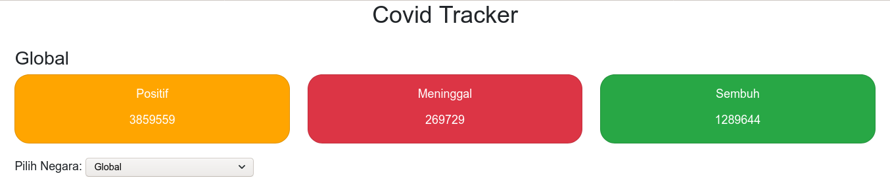

# Covid Tracker

Web that track Covid 19 cases globally and per country

## Installation and Run process

    1. Download or clone this repo to your local environment.
    2. Navigate to the folder that already been downloaded with terminal. Then type `npm install` in the terminal to install all the dependecies (Assume that you already install npm and node on your computer)
    3. Start the web on your localhost by type in the terminal `npm start`. This script will run your web on your localhost which by default is port 3000

Below is the main page of the web

